# Proyecto Clínica

Bienvenido a **Proyecto Clínica**, una plataforma integral diseñada para modernizar y optimizar la gestión de servicios médicos. Este sistema conecta a pacientes, médicos y administradores en un entorno digital eficiente, seguro y fácil de usar.

## ¿Qué soluciona?

Este proyecto aborda la necesidad de centralizar y agilizar los procesos clínicos tradicionales. Soluciona problemas comunes como:

- **Gestión de Citas**: Elimina la complejidad de agendar citas telefónicamente, permitiendo a los pacientes autogestionar su agenda.
- **Historial Clínico**: Digitaliza los registros médicos para que estén disponibles de forma segura y al instante para los doctores durante las consultas.
- **Atención al Usuario (PQRS)**: Proporciona un canal directo y transparente para que los pacientes radiquen peticiones, quejas, reclamos o sugerencias.
- **Administración de Recursos**: Facilita a los administradores la gestión del personal médico y el monitoreo del funcionamiento de la clínica.

---

## Tecnologías Utilizadas

El proyecto está construido con una arquitectura moderna y escalable, separando el frontend del backend para asegurar flexibilidad y rendimiento.

### Backend (Servidor)

El núcleo del sistema es robusto y seguro, encargado de la lógica de negocio y la persistencia de datos.

- **Lenguaje**: Java 17+
- **Framework**: Spring Boot 3 (Web, Data JPA, Validation, Security, Mail)
- **Base de Datos**: MySQL / PostgreSQL
- **Autenticación**: JSON Web Tokens (JWT)
- **Almacenamiento de Imágenes**: Cloudinary
- **Herramientas de Construcción**: Gradle
- **Testing**: JUnit 5, Mockito

### Frontend (Cliente)

Una interfaz de usuario dinámica y responsiva construida como una Single Page Application (SPA).

- **Framework**: Angular 16+
- **Lenguaje**: TypeScript
- **Estilos**: CSS Moderno / Diseño Responsivo
- **Ruteo**: Angular Router con Guards para protección de rutas

---

## Recorrido de la Aplicación

La plataforma ofrece experiencias personalizadas según el rol del usuario:

### 1. Usuario Visitante (No Registrado)

- **Página de Inicio**: Vista general de la clínica y sus servicios.
- **Registro**: Formulario para que nuevos pacientes creen su cuenta.
- **Login**: Acceso seguro para todos los roles (Paciente, Médico, Admin).

### 2. Paciente

Una vez autenticado, el paciente accede a su panel personal:

- **Dashboard**: Resumen de sus próximas actividades.
- **Agendar Cita**: Selección de especialidad, médico y horario disponible.
- **Mis Citas**: Listado de citas programadas con opción de cancelación.
- **Historial Médico**: Consulta de atenciones pasadas y diagnósticos.
- **PQRS**: Módulo para crear y dar seguimiento a solicitudes o quejas.

### 3. Médico

Los doctores cuentan con herramientas para gestionar su día a día:

- **Agenda**: Visualización de su horario y citas programadas.
- **Atención de Citas**: Interfaz para realizar la consulta, registrar síntomas, diagnóstico y tratamiento.
- **Historial de Pacientes**: Acceso a la información clínica de los pacientes que atiende.
- **Días Libres**: Gestión de su disponibilidad.

### 4. Administrador

El rol encargado del control total del sistema:

- **Gestión de Médicos**: Registrar, editar o eliminar perfiles médicos.
- **Gestión de Citas**: Supervisión global de la agenda de la clínica.
- **Gestión de PQRS**: Revisión y respuesta a las solicitudes de los pacientes.

---

## Estructura del Proyecto

El repositorio está organizado en dos directorios principales:

- \`backend-clinica/\`: Código fuente del servidor Spring Boot.
- \`frontend-clinica/my-app/\`: Código fuente de la aplicación Angular.

## Cómo Iniciar

### Prerrequisitos

- Java JDK 17+
- Node.js y NPM
- MySQL o PostgreSQL instalado y corriendo

### Backend

1. Navega a \`backend-clinica\`.
2. Configura las credenciales de base de datos en \`application.properties\`.
3. Ejecuta: \`./gradlew bootRun\`

### Frontend

1. Navega a `frontend-clinica/my-app`.
2. Instala dependencias: `npm install`.
3. Inicia el servidor de desarrollo: `ng serve`.
4. Abre tu navegador en `http://localhost:4200`.

## Capturas de Pantalla

### General

|                    Inicio                     |               Login               |
| :-------------------------------------------: | :-------------------------------: |
|  | 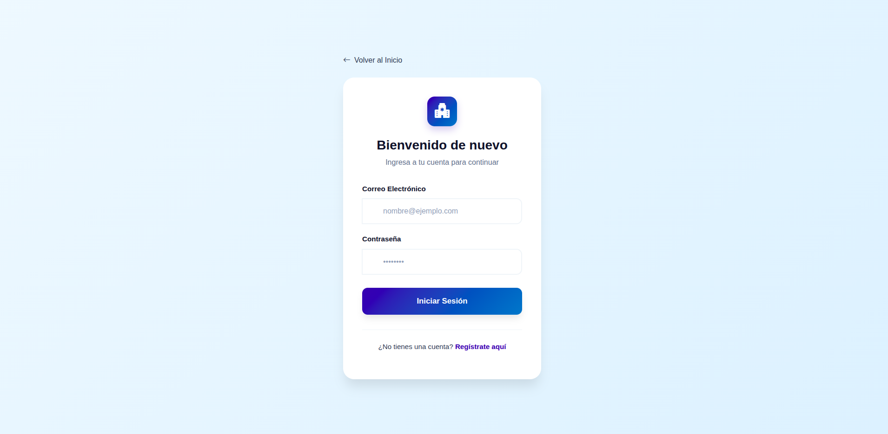 |

|                          Registro                           |
| :---------------------------------------------------------: |
| 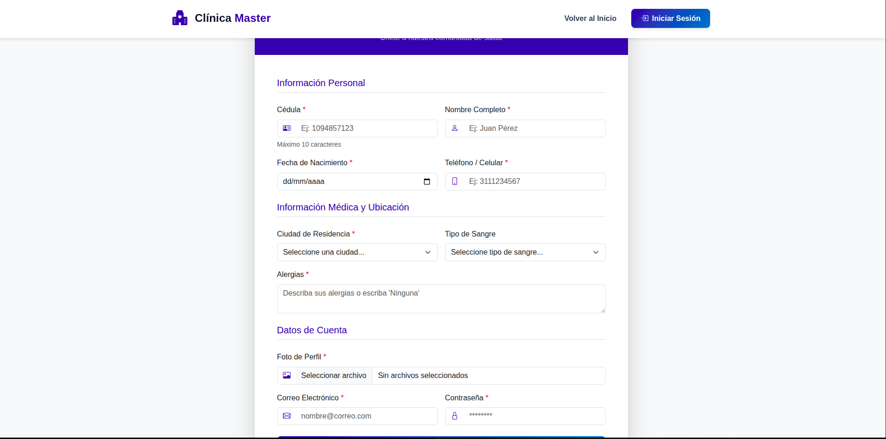 |

### Paciente

|              Panel Principal               |                    Agendar Cita                     |
| :----------------------------------------: | :-------------------------------------------------: |
| 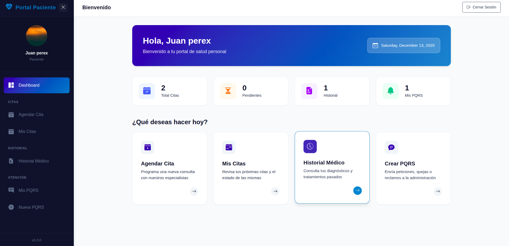 | 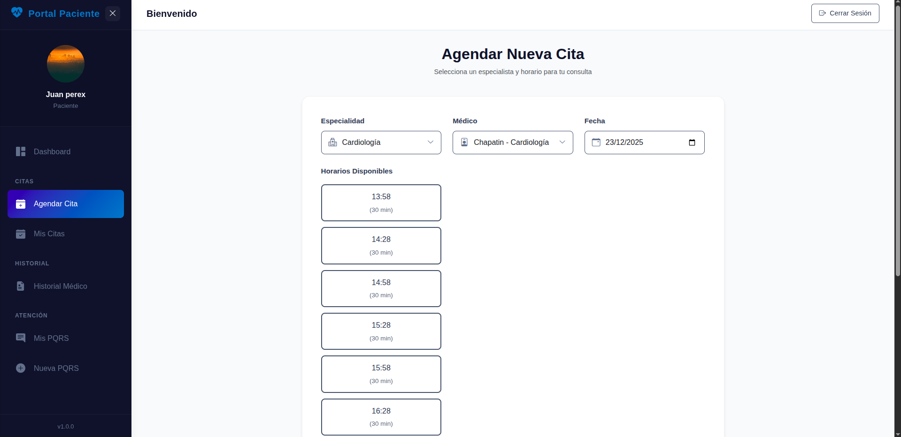 |

|                 Mis Citas                  |                     Historial Médico                     |
| :----------------------------------------: | :------------------------------------------------------: |
| 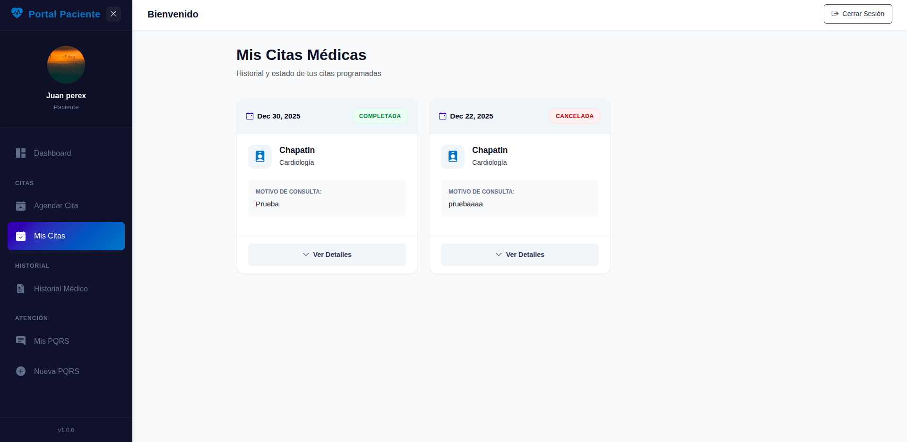 |  |

|                   PQRS                   |                 Crear PQRS                  |
| :--------------------------------------: | :-----------------------------------------: |
| 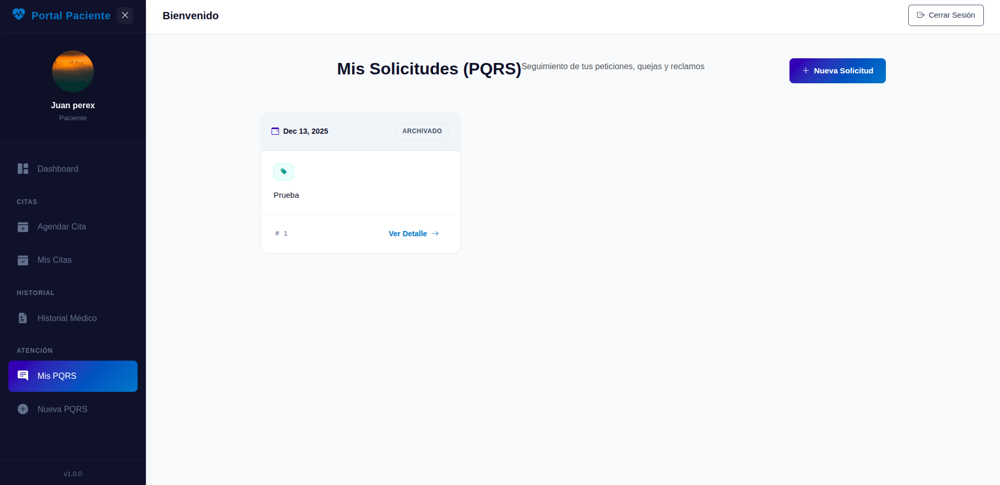 | 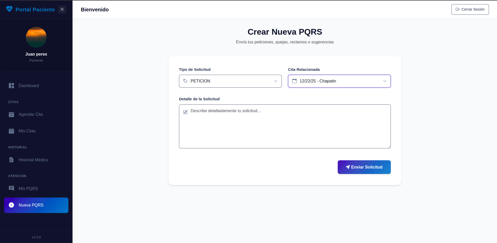 |

### Médico

|               Portal Médico                |                          Atenciones                          |
| :----------------------------------------: | :----------------------------------------------------------: |
| 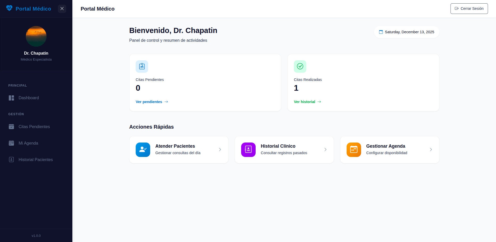 | 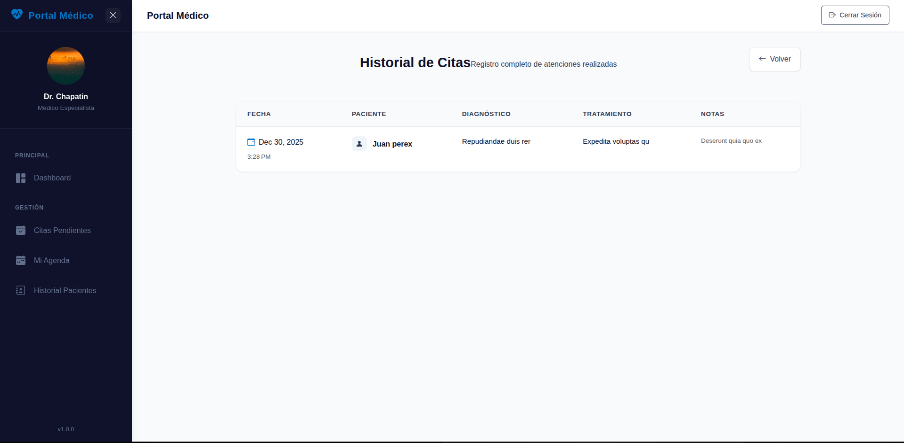 |

### Administrador

|                  Panel Admin                  |                 Lista de Médicos                  |
| :-------------------------------------------: | :-----------------------------------------------: |
| 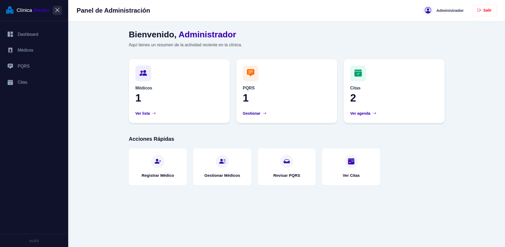 | 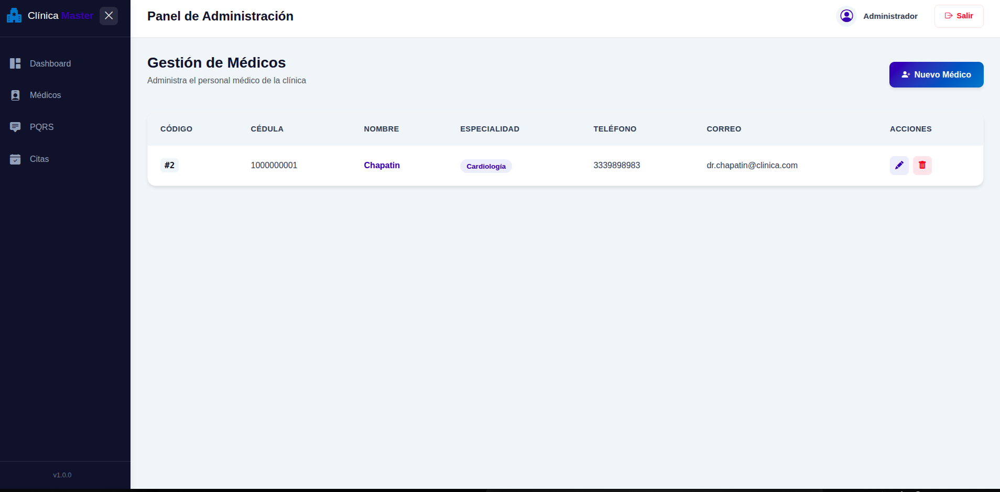 |
